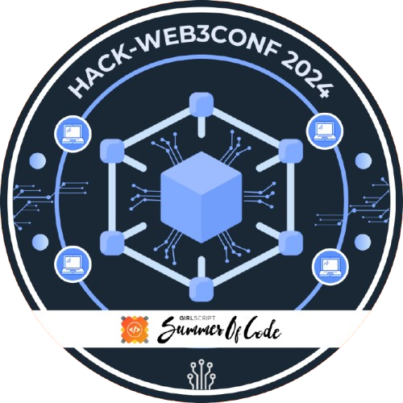
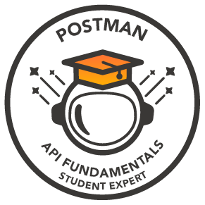

# 💫 About Me:
2nd Year CS Student | Open Source Contributor  🎓B.Tech in Computer Science at Asansol Engineering College.  💡Skills: C, HTML, CSS, Python, Java, Web Development.  🔍Interests:AI, Full-Stack Development, Game Development.

## 🌐 Socials:
 

# 💻 Tech Stack:
     

# ⚡Open Source Programs & Achievements:

  <table style="height: 100%;">
    <tr align="center" style="height: 100%;">
      <td style="border-right: 1px solid #dddddd; padding: 15px; height: 100%;" valign="top" width="50%">
        <a href="https://gssoc.girlscript.tech/leaderboard">
          
           
          <strong>GirlScript Summer of Code Extend</strong>
        </a>
         
        🅠Ranked 27th
         
        
          Out of 32000+ participants 
          PRs Merged: 86  
          Total Badges: 9 
          Total Score: 3040 
        
      </td>
      <td style="padding: 15px; height: 100%;" valign="top" width="50%">
        <table style="height: 100%;">
          <tr align="center">
            <td style="border-right: 1px solid #dddddd; padding: 10px;" width="100">
              
               
              <strong>Explorer Badge</strong>
            </td>
            <td style="border-right: 1px solid #dddddd; padding: 10px;" width="100">
              
               
              <strong>Adventurer Badge</strong>
            </td>
            <td style="border-right: 1px solid #dddddd; padding: 10px;" width="100">
              
               
              <strong>Champion Badge</strong>
            </td>
            <td style="padding: 10px;" width="100">
              
               
              <strong>Trailblazer Badge</strong>
            </td>
            <!-- New column spanning both rows for "Conqueror Badge" -->
            <td style="padding: 10px; border-left: 1px solid #dddddd;" width="100" rowspan="2">
              
               
              <strong>Conqurer Badge</strong>
            </td>
          </tr>
          <tr align="center" style="height: 100%;">
            <td style="border-right: 1px solid #dddddd; padding: 10px;" width="100">
              
               
              <strong>Summit Seeker Badge</strong>
            </td>
            <td style="border-right: 1px solid #dddddd; padding: 10px;" width="100">
              
               
              <strong>Innovator Badge</strong>
            </td>
            <td style="border-right: 1px solid #dddddd; padding: 10px;" width="100">
              
               
              <strong>Web3Hack Badge</strong>
            </td>
            <td style="padding: 10px;" width="100">
              
               
              <strong>API Student Expert</strong>
               
              Postman
            </td>
          </tr>
        </table>
      </td>
    </tr>
  </table>

# 📊 GitHub Stats:
 
 

## 🏆 GitHub Trophies

### ✍️ Random Dev Quote

---

